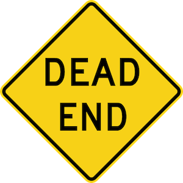

  

***

## Description

This repository contains an enhanced DNS filter designed specifically for AdGuard Home. The [**filter.txt**](filter.txt) file provides comprehensive blocking of various unwanted domains and their subdomains, including:

- **Advertising, CPA, and banner networks** 💩
- **Tracking and telemetry services** 📡
- **CNAME cloaking techniques, analytics, and metrics collection** 🕵️
- **Chat widgets, cookie consent, and push notification services** 🔕
- **Selected adware, spyware, and malware domains** 🤬

You are free to use this filter in any way you see fit. The list is regularly updated and maintained to ensure ongoing effectiveness. 🚀

## Note

This filter is specifically optimized for use **ONLY** with **AdGuard Home** 🛡️
If you encounter any false positives or would like to suggest additional domains for blocking, please feel free to [open a new Issue](https://github.com/ammnt/DeadEnd/issues/new). 🙋♂️