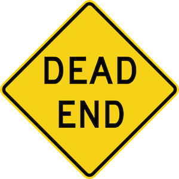

<p align="center">
  
</p>

[](https://github.com/ammnt/DeadEnd/actions/workflows/build.yml)

[](https://github.com/ammnt/DeadEnd/stargazers)
[](https://github.com/ammnt/DeadEnd/blob/main/CONTRIBUTING.md)
[](https://github.com/ammnt/DeadEnd/issues)


***

## Description

This repository contains an enhanced DNS filter designed specifically for AdGuard Home. The [**filter.txt**](filter.txt) file provides comprehensive blocking of various unwanted domains and their subdomains, including:

- **Advertising, CPA, and banner networks** 💩
- **Tracking and telemetry services** 📡
- **CNAME cloaking techniques, analytics, and metrics collection** 🕵️
- **Chat widgets, cookie consent, and push notification services** 🔕
- **Selected adware, spyware, and malware domains** 🤬

You are free to use this filter in any way you see fit. The list is regularly updated and maintained to ensure ongoing effectiveness 🚀

## Repository structure
```bash
DeadEnd/
├── 🤖 AGENTS.md                         # AI agent instructions and project context
├── 🤝 CODE_OF_CONDUCT.md                # Code of conduct for contributors
├── ⚙️ configuration.json                # Build configuration and external source lists
├── 💻 CONTRIBUTING.md                   # Contributing guidelines
├── 📝 .editorconfig                     # EditorConfig for consistent coding styles
├── ✅ exclusions.txt                    # Explicit domains to never block (false positives)
├── 🧹 filter.txt                        # Auto-generated blocklist for AdGuard Home
├── 🔎.aglintrc.yaml                     # Generated config for AGLint tool
├── 🔧 .gitattributes                    # Git attributes for language detection
├── 🗂️ .github/                          # GitHub-specific configuration
│   ├── 🤖 dependabot.yml                # Automated dependency update rules
│   ├── 📋 ISSUE_TEMPLATE/               # Issue creation templates
│   │   ├── 🐛 bug_report.md             # False positive/negative or bug report
│   │   ├── ⚙️ config.yml                # Issue templates configuration
│   │   └── 💡 feature_request.md        # New feature or domain source request
│   ├── 🔀 PULL_REQUEST_TEMPLATE.md      # Pull request checklist and template
│   └── 🔄 workflows/                    # GitHub Actions CI/CD pipelines
│       ├── 🔨 build.yml                 # Scheduled filter building and testing
│       └── 🔒 codeql.yml                # CodeQL static security analysis
├── 🙈 .gitignore                        # Git ignore rules
├── ➕ inclusions.txt                    # Explicit domains to block (manual additions)
├── ⚖️ LICENSE                           # MIT License agreement
├── 🎨 logo.png                          # Project logo and branding
├── 📦 package.json                      # Node.js dependencies and build scripts
├── 📖 README.md                         # Main project documentation
├── 🔒 SECURITY.md                       # Security policy and vulnerability reporting
└── 🧶 yarn.lock                         # Yarn dependency lock file
```

## Note

This filter is specifically optimized for use **ONLY** with **AdGuard Home** 🛡️
If you encounter any false positives or would like to suggest additional domains for blocking, please feel free to [open a new Issue](https://github.com/ammnt/DeadEnd/issues/new) 🙋
